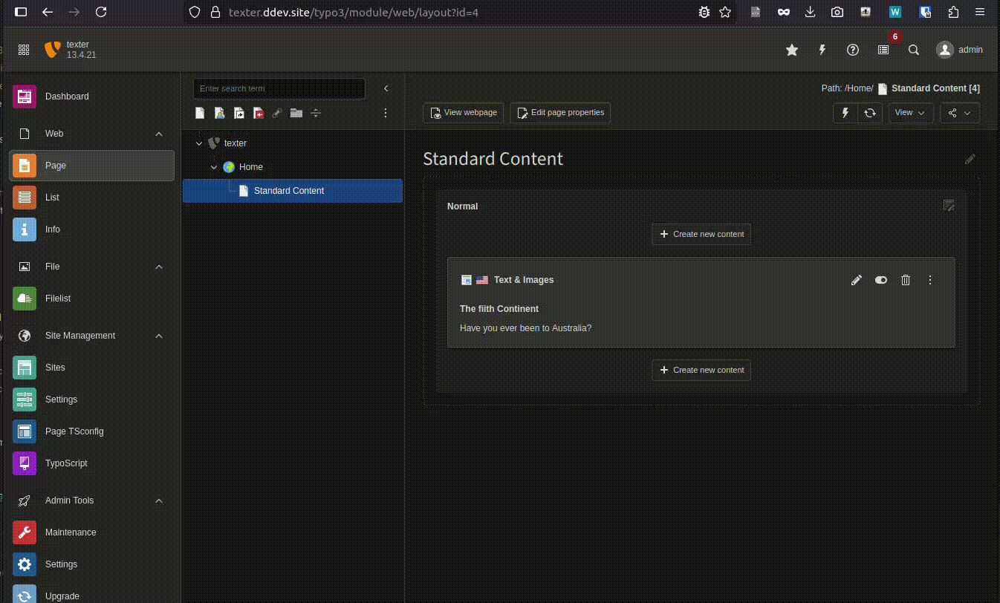
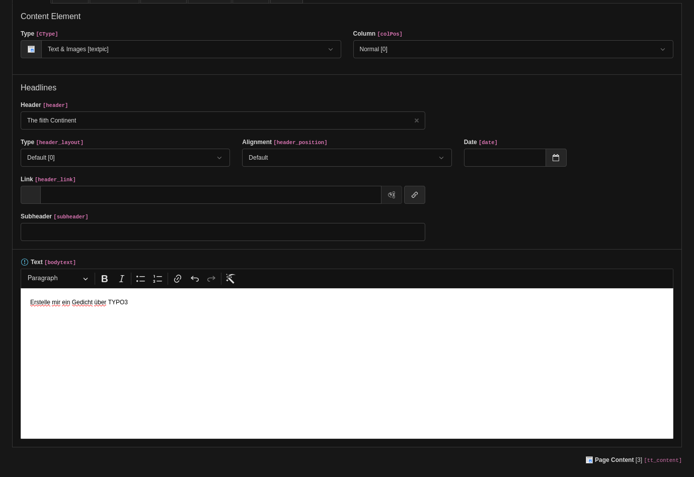
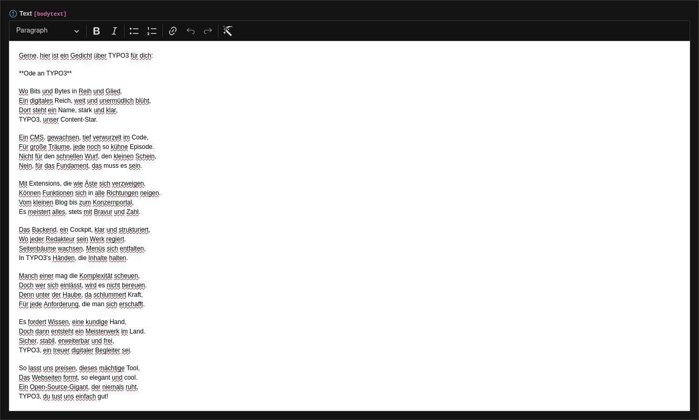
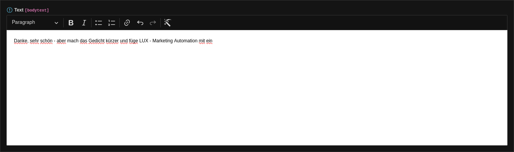
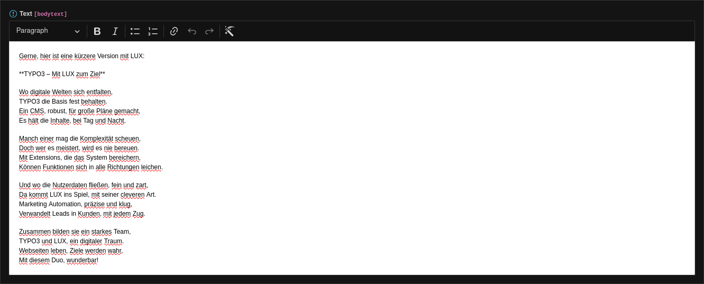

# Texter - AI generated texts in TYPO3 with Google Gemini

## Introduction

Add AI integration to TYPO3 backend. We simply added a CKEditor plugin to generate texts from AI (Gemini). 

Example integration into TYPO3 backend.

Example Video

Better quality: https://www.youtube.com/watch?v=yPFrigLah3o

Video image #1


Video image #2


Video image #3


Video image #4


## Google Gemini

- To use the extension, you need a **Google Gemini API** key. You can register for one
  at https://aistudio.google.com/app/api-keys.

## Installation

### With composer

```
composer req in2code/texter
```

### Main configuration

After that, you have to set some initial configuration in Extension Manager configuration:

| Title         | Default value | Description                                                                                                                                          |
|---------------|---------------|------------------------------------------------------------------------------------------------------------------------------------------------------|
| promptPrefix  | -             | Prefix text that should be always added to the prompt at the beginning                                                                               |
| apiKey        | -             | Google Gemini API key. You can let this value empty and simply use ENV_VAR "GOOGLE_API_KEY" instead if you want to use CI pipelines for this setting |

Note: It's recommended to use ENV vars for in2code/imager instead of saving the API-Key in Extension Manager configuration

```
GOOGLE_API_KEY=your_api_key_from_google
```

### RTE configuration

Per default, in2code/texter sets a default RTE configuration via Page TSConfig:

```
RTE.default.preset = texter
```

If you want to overrule this default setting, you can require in2code/texter in your sitepackage (to ensure that your
extension is loaded after texter) and define a different default preset.
Check file [Texter.yaml](Configuration/RTE/Texter.yaml) for an example how to add texter to your RTE configuration.

**Hint** You can also use texter for selected RTE fields in backend. Example Page TSConfig:

```
RTE.config.tt_content.bodytext.preset = texter
RTE.config.tx_news_domain_model_news.bodytext.preset = texter
```

## Changelog and breaking changes

| Version | Date       | State   | Description                       |
|---------|------------|---------|-----------------------------------|
| 1.0.0   | 2025-12-06 | Task    | Initial release of in2code/texter |


## Contribution with ddev

This repository provides a [DDEV]()-backed development environment. If DDEV is installed, simply run the following
commands to quickly set up a local environment with example usages:

* `ddev start`
* `ddev initialize`

**Backend Login:**
```
Username: admin
Password: admin
```

**Installation hint:**

1. Install ddev before, see: https://ddev.readthedocs.io/en/stable/#installation
2. Install git-lfs before, see: https://git-lfs.github.com/
3. You can place .ddev/.env with the google API key

```
GOOGLE_API_KEY=your_api_key_from_google
```